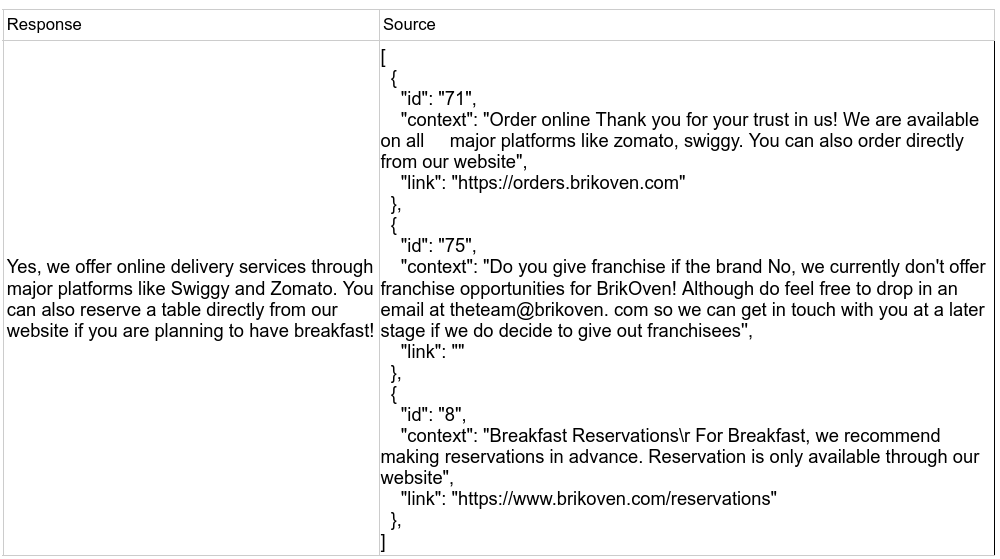
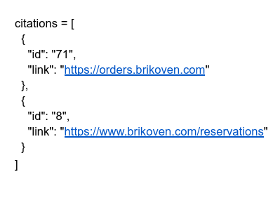
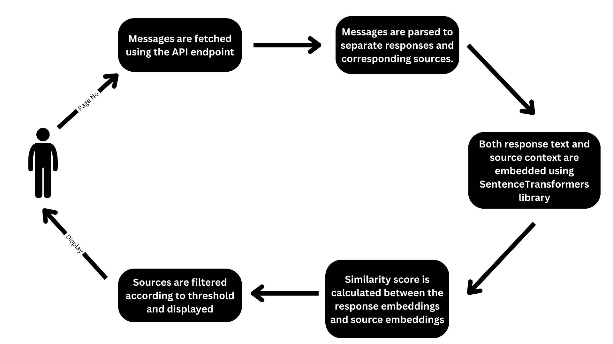
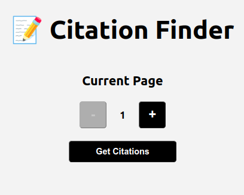
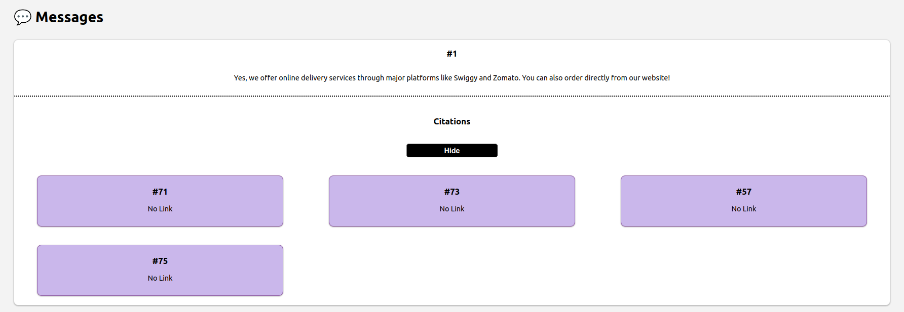

  <a name="readme-top"></a>

  <p align="center">
    <h1>📝 Citation Finder</h1>
  </p>

  <h2>Table of Contents</h2>
  <ol>
    <li>
      <a href="#about-the-project">About The Project</a>
      <ul>
        <li><a href="#flow">Flow</a></li>
        <li><a href="#built-with">Built With</a></li>
        <li><a href="#project-structure">Project Structure</a></li>
      </ul>
    </li>
    <li>
      <a href="#getting-started">Getting Started</a>
      <ul>
        <li><a href="#prerequisites">Prerequisites</a></li>
        <li><a href="#installation">Installation</a></li>
      </ul>
    </li>
    <li><a href="#usage">Usage</a></li>
    <ul>
        <li>App</li>
        <li>Output</li>
    </ul>
    <li><a href="#references">References</a></li>
  </ol>

## About The Project

Given a set of probable sources associated with a response, this project aims to provide you with the list of sources that the response has been generated from.

<b>Example Input</b>
<div style="display:flex; flex-direction:column">

<br/>
</div>
<br/>
<b>Example Output</b>
<div style="display:flex; flex-direction:column">

<br/>
</div>

### Flow
<div style="display: flex; justify-content: center;">
  
</div>

### Built With

- **Frontend**: [ReactJS](https://react.dev/)
- **Backend**: [FastAPI](https://fastapi.tiangolo.com/)
- **Model**: [SentenceTransformers](https://sbert.net/) + [Cosine Similarity](https://www.sciencedirect.com/topics/computer-science/cosine-similarity)

<p align="right">(<a href="#readme-top">back to top</a>)</p>

### Project Structure
```
├── model/
│   ├── config.py
│   ├── model.py
│   ├── preprocess.py
│   └── requirements.txt
├── client/
│   ├── node_modules
│   ├── public
│   ├── src
│   ├── .gitignore
│   ├── package-lock.json
│   └── package.json
├── .gitignore
├── LICENSE
└── README.md
└── server.py
```

#### Structure Description:
- **model**: contains the python model
- **client**: contains the react frontend
- **server.py**: contains fastAPI backend

## Getting Started

The project requires manual installation of pre-requisites and their respective requirements as given in **model/requirements.txt** for the model and **client/package.json** for the client.

### Prerequisites

* Python: [How to install Python?](https://www.python.org/downloads/)
* Node: [How to install Node?](https://nodejs.org/en/download/package-manager)
  
### Installation

1. Install Python requirements using pip. (Prefer using a virtual environment)
  ```sh
    pip install -r model/requirements.txt
  ```
   
2. Install React requirements using npm.
    ```sh
    cd client
    npm install
    cd ..
    ```
3. Run backend fastAPI server
   ```sh
   fastapi dev server.py
   ```

4. Run React client
   ```sh
    cd client/
    npm start
   ```
The project should be up when you visit localhost at port 3000.

### About Config
Following variable can hugely affect the quality of finding citations. It can be changed in the **model/config.py**.

**SIMILARITY_THRESHOLD**: Is used to compare how similar the response text should be to the context of the source.
- It can range from 0 to 1
- Increase this to increase quality of found citations.
- Increasing it too much might lead to no results in some cases.

<p align="right">(<a href="#readme-top">back to top</a>)</p>

## Usage

### App
<div style="display: flex; justify-content: center;">
  
</div>

**Current Page**: Page number associated with the test API endpoint.

<hr>

### Output
<div style="display: flex; justify-content: center;">
  
</div>
<hr>

## References

* [GloVe Embeddings](https://nlp.stanford.edu/pubs/glove.pdf)
* [React JS Documentation](https://react.dev/reference/react)
* [Numpy Documentation](https://numpy.org/doc/)
* [NLTK Documentation](https://www.nltk.org/api/nltk.html)
* [SentenceTransformers Documentation](https://sbert.net/)
  
<p align="right">(<a href="#readme-top">back to top</a>)</p>
